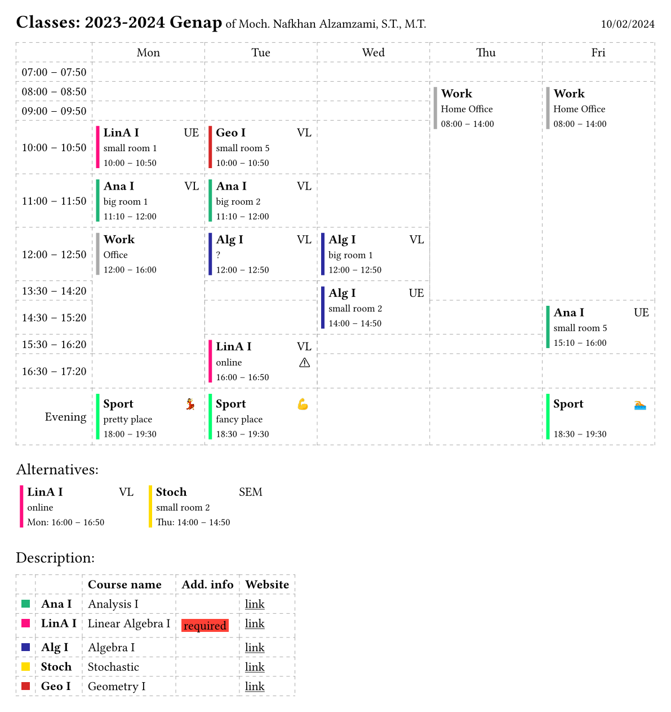

# typst-timetable

Forked from [@ludwig-austermann/typst-timetable](https://github.com/ludwig-austermann/typst-timetable).

A typst template for timetables

**New in this fork**:

- Additional minutes support with new time format: `"hh:mm"`.

## Features

A resulting timetable looks like this:


- Collision detection
- Automatic extension over multiple fields / cells / time slots
- ...

## Usage

The main difficulty lies in defining the dictionary with the necessary data. Take a look into the example to see how a `json` or `toml` file can be used to specify the data, which can then be included into `.typ` files.

### Functions

The exposed `timetable` function takes the following arguments:

- `data`: is the necessary data input
- `date: datetime.today().display("[day].[month].[year]")`: the date to be displayed in the header
- `show-header: true`: if to show the header
- `show-alternatives: true`: if to show collisions and their corresponding alternatives
- `show-description: true`: if to show the description table
- `tablex-args: (:)`: arguments to be passed to the underlying tablex table, to overwrite the style
- `event-cell: default-blocks.event-cell`: how to display the events
- `time-cell: default-blocks.time-cell`: how to display the time cells
- `color-theme: tab`: for automatical coloring of courses

### Data Dictionary

```
language
    title "Schedule of"
    of "of"
    alternatives "Conflicts"
    description "Description"

general
    period
    person
    weekdays
    times: array
        start [end - defaults.duration]
        end [start + defaults.duration]
        display: string [start "--" end]
        show-time [false]

defaults
    duration ["02:00"]

description?: array
    id
    title
    type: text|link|content [text]

courses: {abbrv}?: string ->
    {description.id}?
    color?
    priority [0]
    hide [false]
    hide-description [false]
    events: {eventtype}?: string ->
        day
        start [end - defaults.duration]
        end [start + defaults.duration]
        room
        priority [thiscourse.priority]
        hide [false]
```

Here `?` denotes optional values, `[]` the corresponding default value, `{}` parametrices keys and `->` denotes another dictionary.

Necessary are only a few options, for a quick start look at this simplified version:

```
language?
    title?: string
    of?: string
    alternatives?: string
    description?: string

general
    period
    person
    weekdays: array of string
    times: array
        start or end

courses: {abbrv}?: string ->
    events: {eventtype}?: string ->
        day
        start or end
        room
```
